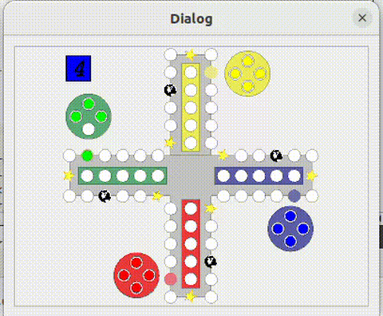
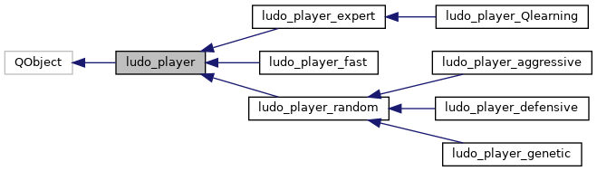

# AI2-LUDO Player


## Project description
This project was developed as a semester project for class AI2 at the University
of Southern Denmark. Goal of the project was to develop an automatic Ludo
player. The player had to be based on some learning or evolution tool, which
was covered by the course, such as Artificial Neural Networks (ANN), Temporal
Difference learning (TD) or Genetic Algorithms (GA).
This project uses player based on Genetic Algorithm.

The LUDO game and GUI was handed out and build upon the work [https://gitlab.com/niive12/ludo-gui](https://gitlab.com/niive12/ludo-gui).

### LUDO Player inheritance diagram
Several "dummy" players and 1 evolving player using an AI algorithm were developed. 
This has led the project to development of class hierarchy, which eases the reuse of common functionality among players.



## How to run:
This guide will walk you through the steps to clone, build, and run the AI2-LUDO project on Ubuntu 22.04.

### Prerequisites
Ensure that you have the following installed:
- Ubuntu 22.04
- Git
- C++ compiler (GCC)
- Qt5 development libraries

### Install Dependencies
Open a terminal and run the following commands to install the required packages:

```bash
sudo apt update
sudo apt install build-essential qtbase5-dev qtchooser qt5-qmake qtbase5-dev-tools g++
```

### Install FANN Library
```bash
sudo apt install libfann-dev
```

### Clone Repo, Build and Run

```bash
git clone https://github.com/BatekPetr/AI2-LUDO.git
cd AI2-LUDO
mkdir build
cd build
qmake ../ludo.pro
make
./ludo
```

## References
- [Project Final Report](./doc/AI2_report_PBatek.pdf)
- [Doxygen Documentation](./doc/html/index.html)
